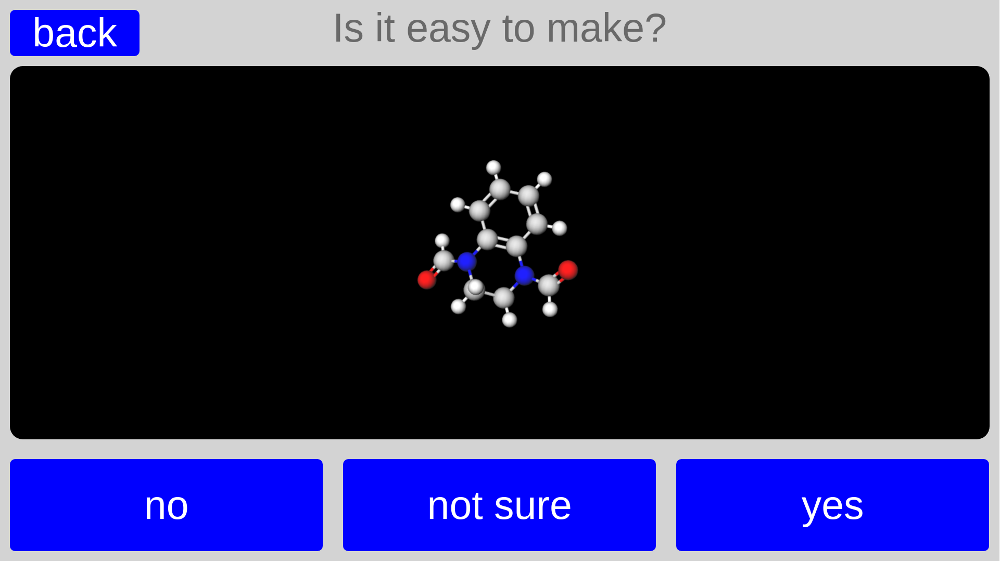
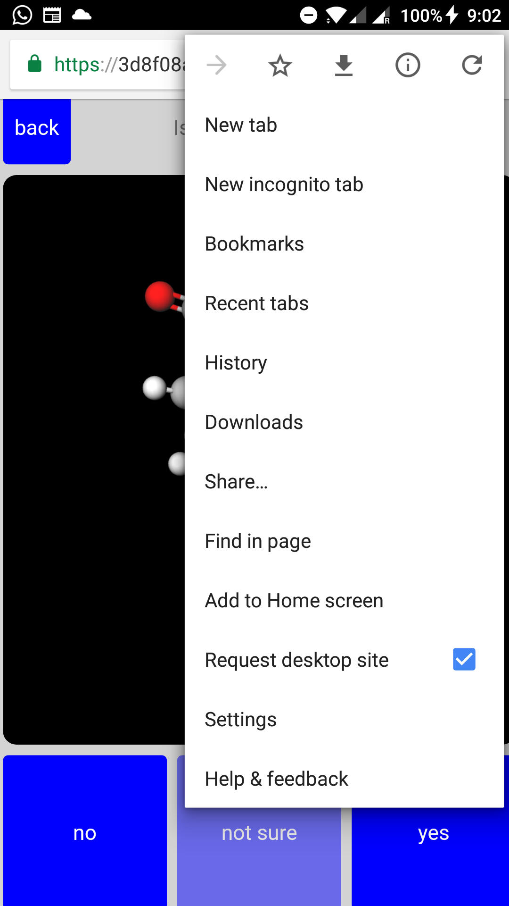

:author: Lukas Turcani
:contact: lukasturcani93@gmail.com

Introduction.
=============

Molder is a data collection website for molecules. When hosted, it
looks like this:

Note that the website shows an interactive 3D rendering of the
molecule and not a 2D picture.

The point is for users to give their opinion on a bunch of molecules
in a database. Data collected in this way can be used for machine
learning or in some other way. The number of buttons and question the
users answer can be changed depending on the task.

Data collection should also work from phones and tablets. The desktop
version of the site may have to be requested by the user's phone for
this to work, however.

The project is written in flask.

How do I use Molder for my project?
===================================

Deploy it like any other flask app.

Molder looks at the file ``database/database.json``, which contains a
number of molecular structures. Users accessing the site will be sent
the structures in this file and when they click a button their
response will be sent back to the server and saved.

The server will send each structure in ``database/databse.json`` to a
single user only, unless the structure is also listed in
``database/shared.json``. If this is the case, then the structure will
be seen by all users.

To make users see your molecules, simply replace the files
``database.json`` and ``shared.json`` with your own.

To change the question and modify the buttons, including adding or
removing them, change ``static/index.html`` and ``static/index.js``.

The server will save the results into a database called ``results.sql``
which holds a single table with the columns ``username``, ``molecule``
and ``opinion``.

Files.
======

:__init__.py: Sets up the flask app.
:site.py: Defines the app code.
:db.py: Defines database code.
:static/index.html: The website.
:static/index.css: Styles the website.
:static/index.js: Makes the website interactive. Handles communication with
                  the server.
:static/colors.html: Gives the name of each element and the corresponding
                     color.
:database/database.json: Holds the database of molecules which are to be
                         evaluated by users. The molecules are stored as a
                         dictionary where the key is the InChI of the molecule
                         and the value is the structural info of the molecule.
                         The structural info is the content of a V3000 ``.mol``
                         file of the molecule.
:database/shared.json: Holds a list of InChIs belonging to molecules in
                       ``database.json``. Molecules in this list will be seen
                       by all users.
